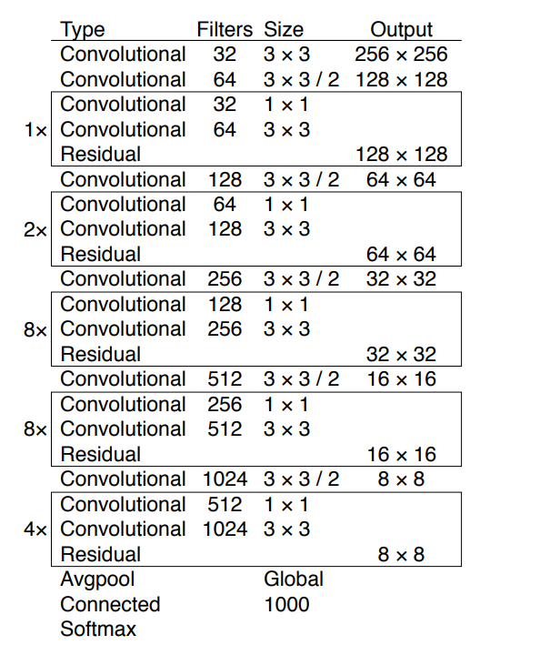
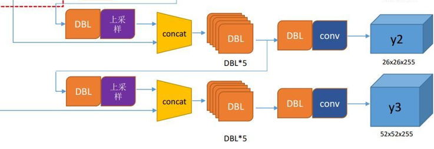
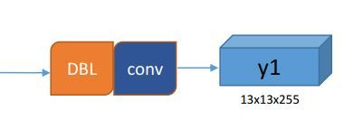
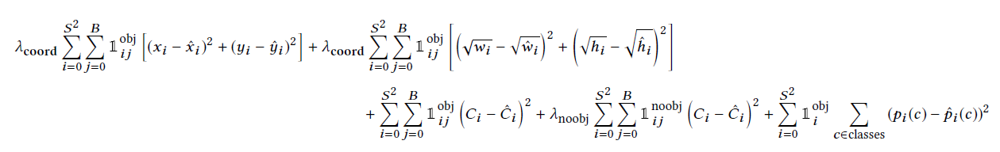

# You Only Look  Once

## Yolov1

### 1、网络结构

​	网络结构和普通的CNN对象分类网络没有本质区别。最大差异是最后输出层用线性函数作为激活函数。原因：**预测的bounding box的位置是数值型，而非对象的概率**

​	其他层使用的激活函数是leaky rectified activation:
$$
\phi(x)=\begin{cases}
x,   \quad \ \ if   \ x>0 \\
0.1x,\ otherwise
\end{cases}
$$

### 2、输入输出结构映射关系


- 输入是原始图像，固定大小作为输入，YOLO设计尺寸448×448
- 输出是一个7x7x30的张量

​       **YOLO将图像分成S×S（S=7）的网格grid cell，并且每个网格单元负责预测B（B=2）个边界框box。加上每个边界框box的置信度confidence，每个网格的C个条件类别概率**


### 3、训练样本标签

图中蓝色，黄色，粉色的框框就是我们标注时候的框框，对应的类别分别为 dog，bicycle，car


- 20个对象分类概率

  ​	论文中有个关键词“responsible”，给出了**仅由中心点所在的网格对预测该对象负责**的这样一个规定

  ​	 意思是说，每个对象（Object）都有一个框框，计算框框的中心点，中心点所在的网格（grid cell）对这个对象负责。例如，狗被标注了一个蓝色的框框，蓝色的框框中心是那个蓝色的圆点，圆点所在的网格（图中蓝色阴影的grid cell）对狗这个Object负责。

   	每个Object找到负责的grid cell后 这个grid cell对应的30维张量中那20个对象分类概率中就把这个Object的类别设为1，其他类别为0。继续上面的例子：蓝色阴影的grid cell对应的30维张量中的20个分类概率中，dog设为1，其他19个类设为0。同样的黄色阴影grid cell类别概率中bicycle设为1，其余19个位0，粉色grid cell类别概率中car设为1，其余19个位0。

  ​	 这样49个30维张量中，3个30维张量的对象分类概率得到了确定，那剩下45个呢？注意"仅由中心点所在的网格对预测该对象负责"这句话中的仅由二字，也就是说及时一个对象横跨了众多grid cell，我们也只关系这个对象中心点所在的grid cell，仅由这个grid cell负责。那剩下的45个30维张量的20个对象分类概率都为0！！！
  ​

- bounding box 

  置信度计算公式
  $$
  Confidence = Pr(Object)*IOU_{pred}^{truth}
  $$
  ​	训练时通过网络的输出，每个grid cell都有2个预测的bounding box。对于对对象负责的grid cell而言，将这两个预测的bounding box分别与真实的bounding box计算IOU，然后最重要的一步！比较两个IOU哪个大，由大的IOU对应的bounding box 负责预测这个对象

  ​	这个负责的bounding box 的$Pr(Object) = 1$,对应的$Confidence = IOU_{pred}^{truth}$;不负责的bounding box 的$Pr(Object) = 0$,对应的$Confidence  = 0$.

  ​	7×7个grid cell，每个grid cell 有两个bounding box ，共计7×7×2=98个bounding box,每个bounding box 都有一个 置信度confidence信息，那么98个中只有3个是计算出的IOU值，其余95个都是0

### 4、损失函数

### 5、预测（inference)与NMS（非极大值抑制）

在inference时，引入一个score公式：score为
$$
Pr(Class|Object)*Pr(Object)*IOU_{pred}^{truth} = Pr(Class)*IOU_{pred}^{truth}
$$
反映了每个bounding box 特定类别的置信度分数。

可前面提到**在inference时候并没有IOU，公式只是为了反应其意义**，对应到inference时候，就是每个bounding box的20个类别概率去乘bounding box 的置信度。

**NMS**对于某一类而言：

1.将所有框的得分排序，选中最高分及其对应的框。
2.遍历其余的框，如果和当前最高分框的重叠面积(**IOU**)大于一定阈值，我们就将框删除。
3.从未处理的框中继续选一个得分最高的，重复上述过程。

## Yolov2

### 改进策略


#### 1、Batch Normalization

提升收敛速度，起到一定正则化效果，降低模型的过拟合，每个卷积层后面都添加Batch Normalization 层，不再使用dropout。

#### 2、High Resolution Classifier

​	目前大部分的检测模型都会在先在ImageNet分类数据集上预训练模型的主体部分ImageNet分类模型基本采用大小为$224*224$ 的图片作为输入，分辨率相对较低，不利于检测模型。所以YOLOv1在采用$224*224$分类模型预训练后，将分辨率增加至$448*448$ ，并使用这个高分辨率在检测数据集上finetune。但是直接切换分辨率，检测模型可能难以快速适应高分辨率。所以YOLOv2增加了在ImageNet数据集上使用$ 448*448$输入来finetune分类网络这一中间过程（10 epochs），这可以使得模型在检测数据集上finetune之前已经适用高分辨率输入。


#### 3、Convolutional With Anchor Boxes

​	YOLOv1最后采用的是全连接层直接对边界框进行预测，其中边界框的宽与高是相对整张图片大小的，而由于各个图片中存在不同尺度和长宽比（scales and ratios）的物体，YOLOv1在训练过程中学习适应不同物体的形状是比较困难的，这也导致YOLOv1在精确定位方面表现较差。RPN对CNN特征提取器得到的特征图（feature map）进行卷积来预测每个位置的边界框以及置信度（是否含有物体），并且各个位置设置不同尺度和比例的先验框，所以RPN预测的是边界框相对于先验框的offsets值，采用先验框使得模型更容易学习。

​	所以YOLOv2移除了YOLOv1中的全连接层而采用了卷积和anchor boxes来预测边界框。为了使检测所用的特征图分辨率更高，移除其中的一个pool层。

​	YOLOv2使用了anchor boxes之后，每个位置的各个anchor box都单独预测一套分类概率值，这和SSD比较类似（但SSD没有预测置信度，而是把background作为一个类别来处理）。

#### 4、Dimension Clusters

Faster R-CNN和SSD中，先验框的维度（长和宽）都是手动设定的，带有一定的主观性。YOLOv2采用k-means聚类方法对训练集中的边界框做了聚类分析。因为设置先验框的主要目的是为了使得预测框与ground truth的IOU更好，所以聚类分析时选用box与聚类中心box之间的IOU值作为距离指标：
$$
d(box,centriod) = 1-IOU(box,centroid)
$$

- **Direct location prediction**

  ​	其中$(C_x,C_y)$为cell的左上角坐标，如下图所示，在计算时每个cell的尺度为1，所以当前cell的左上角坐标为$(1,1)$。由于sigmoid函数的处理，边界框的中心位置会约束在当前cell内部，防止偏移过多。而$p_w$和$p_h$是先验框的宽度与长度，前面说过它们的值也是相对于特征图大小的，在特征图中每个cell的长和宽均为1。这里记特征图的大小为$(W,H)$（在文中是$(13,13)$)，这样我们可以将边界框相对于整张图片的位置和大小计算出来（4个值均在0和1之间):
  $$
  b_x = (\sigma(t_x)+c_x)/W  \\
  b_y = (\sigma(t_y)+c_y)/H  \\
  b_w = p_we^{t_w} /W   \\
  b_h = p_he^{t_h}/H
  $$
  如果再将上面的4个值分别乘以图片的宽度和长度（像素点值）就可以得到边界框的最终位置和大小了。

  

## Yolov3(加入代码解析)


​								**yolo_v3结构图**

### 1、模型认知

- **公用卷积层**

  ```python
  def conv2d(inputs, filters, kernel_size, strides=1):
      #在resnet网络模型中，我们也见过
      def _fixed_padding(inputs, kernel_size):
          pad_total = kernel_size - 1
          pad_beg = pad_total // 2
          pad_end = pad_total - pad_beg

          padded_inputs = tf.pad(inputs, [[0, 0], [pad_beg, pad_end],
                                          [pad_beg, pad_end], [0, 0]], mode='CONSTANT')
          return padded_inputs
      if strides > 1: 
          inputs = _fixed_padding(inputs, kernel_size)
      inputs = slim.conv2d(inputs, filters, kernel_size, stride=strides,
                           padding=('SAME' if strides == 1 else 'VALID'))
      return inputs
  ```

- **Feature Extractor**

  

  **网络结构**：Darknet-53 without FC layer

  ```python
  def darknet53_body(inputs):
      def res_block(inputs, filters):
          shortcut = inputs
          net = conv2d(inputs, filters * 1, 1)
          net = conv2d(net, filters * 2, 3)
          net = net + shortcut
          return net
      # first two conv2d layers
      net = conv2d(inputs, 32,  3, strides=1) #1
      net = conv2d(net, 64,  3, strides=2)  #2 ,map size=(w/2,h/2)
      # res_block * 1
      net = res_block(net, 32) #3-4
      net = conv2d(net, 128, 3, strides=2) #5 ,map size=(w/4,h/4)
      # res_block * 2
      for i in range(2):
          net = res_block(net, 64) #6，7，8，9
      net = conv2d(net, 256, 3, strides=2) #10,map size=(w/8,h/8)
      # res_block * 8
      for i in range(8):
          net = res_block(net, 128) #11-26
      route_1 = net  #26 
      net = conv2d(net, 512, 3, strides=2)  #27,map size=(w/16,h/16)
      # res_block * 8
      for i in range(8):
          net = res_block(net, 256) #28-43
      route_2 = net #43
      net = conv2d(net, 1024, 3, strides=2) #44,map size=(w/32,h/32)
      # res_block * 4
      for i in range(4):
          net = res_block(net, 512) #45-52
      route_3 = net #52
      return route_1, route_2, route_3
  ```

- **FPN多尺度特征提取**

  ​	在**较深处，尺寸较小**的特征图对尺寸**较大**的物体检测效果**较好**，但是包含的信息较集中，所以**不适合**较小的物体检测。所以我们用较浅处的卷积层用来检测小物体，但是试验证明，**不能仅仅**只使用较浅层的卷积层（可能因为仅仅用较浅层，包含的信息不够抽象），所以我们需要将较深处的卷积层进行**上采样**，然后与较浅的特征图进行融合，这里的上采样，可以使用**反卷积**和**插值**。（代码中使用了最近邻插值）。

  ```python
  def upsample_layer(inputs, out_shape):
      new_height, new_width = out_shape[1], out_shape[2]
      # NOTE: here height is the first
      # TODO: Do we need to set `align_corners` as True?
      inputs = tf.image.resize_nearest_neighbor(inputs, (new_height, new_width), name='upsampled') #使用最近邻插值法对图片进行上采用
      return inputs
  ```

  

  对应代码

  ```python
  #上述输出的第前2层结果先做卷积，再上采样
  inter1 = conv2d(inter1, 256, 1) 
  #这里使用最近邻插值法对图片上采用上采样，这里采样后的大小和route_2一样
  inter1 = upsample_layer(inter1, route_2.get_shape().as_list() if self.use_static_shape else tf.shape(route_2))
  concat1 = tf.concat([inter1, route_2], axis=3) #对route_3上采样的结果和route_2进行融合（不是按位相加）

  inter2, net = yolo_block(concat1, 256) #对上述融合结果进行卷积处理，输出处理后的最后一层（net）和倒是第二层的（inter2）
  feature_map_2 = slim.conv2d(net, 3 * (5 + self.class_num), 1,
                              stride=1, normalizer_fn=None,
                              activation_fn=None, biases_initializer=tf.zeros_initializer()) #第二个feature map
                                                                      #shape为（bz，w/16，h/16，3*(5 + self.class_num)）
  feature_map_2 = tf.identity(feature_map_2, name='feature_map_2') #将这个化为操作op

  #上述输出（feature_map_2）的第前2层进行上采用，使得size大小为（w/8，h/8）
  inter2 = conv2d(inter2, 128, 1)
  inter2 = upsample_layer(inter2, route_1.get_shape().as_list() if self.use_static_shape else tf.shape(route_1))
  concat2 = tf.concat([inter2, route_1], axis=3) #结合

  _, feature_map_3 = yolo_block(concat2, 128) #最后还是将融合的结果放入yolo_block中
  feature_map_3 = slim.conv2d(feature_map_3, 3 * (5 + self.class_num), 1,
                              stride=1, normalizer_fn=None,
                              activation_fn=None, biases_initializer=tf.zeros_initializer())#最后一个feature_map,用来检测小的物体
                                                                  #shape为（bz，w/8，h/8，3*(5 + self.class_num)）
  feature_map_3 = tf.identity(feature_map_3, name='feature_map_3')
  ```

  ​

- **YOLO_BLOCK  and output**

  

  ```python
  def yolo_block(inputs, filters):
      net = conv2d(inputs, filters * 1, 1)
      net = conv2d(net, filters * 2, 3)
      net = conv2d(net, filters * 1, 1)
      net = conv2d(net, filters * 2, 3)
      net = conv2d(net, filters * 1, 1)
      route = net
      net = conv2d(net, filters * 2, 3)
      return route, net
  ```

  **output说明**

  ```python
  with tf.variable_scope('darknet53_body'):
   	route_1, route_2, route_3 = darknet53_body(inputs) 
  #shape分别为（w/8,h/8），（w/16,h/16），(w/32,h/32)
  with tf.variable_scope('yolov3_head'):
      inter1, net = yolo_block(route_3, 512) 
  #这是一个卷积层，返回卷积结果的最后一层（net）和倒数第二层（inter1）
      feature_map_1 = slim.conv2d(net, 3 * (5 + self.class_num), 1,
                                    stride=1, normalizer_fn=None,
                                   activation_fn=None, biases_initializer=tf.zeros_initializer()) 
  #最后一层接（1，1）卷积输出shape为（bz，w/32，h/32，3*(5 + self.class_num)）
  	feature_map_1 = tf.identity(feature_map_1, name='feature_map_1') #tf.identity是返回一个一模一样新的tensor的op2、Anchor
  ```

  ​

### 2、Anchor

​	共设置9个宽高不同的anchor（同样是通过聚类获取得到），每个cell的anchor的数量为9/3=3个，因为YOLO V3**有3个feature_map**，不同feature_map的**size和感受野**是不一样的，**较小**size的feature_map具有**较大的感受野**，所以负责检测**较大**的物体，同理，**较大**size的feature_map**感受野较小**，负责检测**较小**的物体。

​	所以在训练前，我们需要**根据自己的数据集通过聚类生成适合自己数据集训练的基础框anchor**,这样可以加速自己的训练进程。

### 3、损失函数



代码标注：

```python
 def loss_layer(self, feature_map_i, y_true, anchors):
        '''
        calc loss function from a certain scale
        input:
            feature_map_i: feature maps of a certain scale. shape: [N, 13, 13, 3*(5 + num_class)] etc.
            y_true: y_ture from a certain scale. shape: [N, 13, 13, 3, 4（宽、高、x,y）+ 1 + num_class + 1（默认权重）] etc. 最后维度是权重
            anchors: shape [3, 2]
        '''
        #  输入为：yolov3的输出张量，图片标注信息 ，聚类获得的anchor
        # size in [h, w] format! don't get messed up!
        grid_size = tf.shape(feature_map_i)[1:3] #输出feature map的宽、高
        # the downscale ratio in height and weight
        ratio = tf.cast(self.img_size / grid_size, tf.float32) #返回的该特征图相对于原图的scale
        # N: batch_size
        N = tf.cast(tf.shape(feature_map_i)[0], tf.float32)

        # 将特征图上预测的框的位置，大小通过anchor先验框映射到原图大小，这里的x_y_offset, pred_boxes都是原图尺寸的
        x_y_offset, pred_boxes, pred_conf_logits, pred_prob_logits = self.reorg_layer(feature_map_i, anchors)

        ###########
        # get mask
        ###########

        # shape: take 416x416 input image and 13*13 feature_map for example:
        # [N, 13, 13, 3, 1]
        object_mask = y_true[..., 4:5] #哪些cell负责检测物体，则该cell为1（三个位置都为1），否则为0

        # the calculation of ignore mask if referred from
        #循环操作，循环的是batch_size，意思就是对每张图片进行分析
        ignore_mask = tf.TensorArray(tf.float32, size=0, dynamic_size=True)
        def loop_cond(idx, ignore_mask): #如果idx小于N
            """
            对每张图片进行分析，循环batch size下
            """
            return tf.less(idx, tf.cast(N, tf.int32))
        def loop_body(idx, ignore_mask):
            """
            每次循环对一张图片中所有预测框和真实框求IOU
            并且剔除一些质量不好的框
            """
            # shape: [13, 13, 3, 4] & [13, 13, 3]  ==>  [V, 4]
            # V: num of true gt box of each image in a batch
            valid_true_boxes = tf.boolean_mask(y_true[idx, ..., 0:4], tf.cast(object_mask[idx, ..., 0], 'bool'))
            # shape: [13, 13, 3, 4] & [V, 4] ==> [13, 13, 3, V]
            iou = self.box_iou(pred_boxes[idx], valid_true_boxes)
            # shape: [13, 13, 3]
            best_iou = tf.reduce_max(iou, axis=-1)
            # shape: [13, 13, 3]
            ignore_mask_tmp = tf.cast(best_iou < 0.5, tf.float32)
            # finally will be shape: [N, 13, 13, 3]
            ignore_mask = ignore_mask.write(idx, ignore_mask_tmp)
            return idx + 1, ignore_mask
        _, ignore_mask = tf.while_loop(cond=loop_cond, body=loop_body, loop_vars=[0, ignore_mask])
        # [N, 13, 13, 3]
        ignore_mask = ignore_mask.stack()
        # shape: [N, 13, 13, 3, 1]
        ignore_mask = tf.expand_dims(ignore_mask, -1)

        # shape: [N, 13, 13, 3, 2]
        # 以下都是相对于原图的
        pred_box_xy = pred_boxes[..., 0:2] #预测的中心坐标
        pred_box_wh = pred_boxes[..., 2:4] #预测的宽高

        # get xy coordinates in one cell from the feature_map
        # numerical range: 0 ~ 1 （数值范围）（转为归一化）
        # shape: [N, 13, 13, 3, 2]
        true_xy = y_true[..., 0:2] / ratio[::-1] - x_y_offset  #将真实的框的中心坐标归一化（映射到特征图）
        pred_xy = pred_box_xy / ratio[::-1] - x_y_offset #将预测的框的中心坐标归一化（映射到特征图）

        # get_tw_th
        # numerical range: 0 ~ 1
        # shape: [N, 13, 13, 3, 2]
        true_tw_th = y_true[..., 2:4] / anchors ##真实的框的宽高相对于anchor的比例
        pred_tw_th = pred_box_wh / anchors #预测的框的宽高相对于anchor的比例
        # for numerical stability 为了数值稳定
        # where会先判断第一项是否为true,如果为true则返回 x；否则返回 y;
        true_tw_th = tf.where(condition=tf.equal(true_tw_th, 0),
                              x=tf.ones_like(true_tw_th), y=true_tw_th) #不允许出现宽高为0的情况，出现了就返回一个宽和高都为1的情况
        pred_tw_th = tf.where(condition=tf.equal(pred_tw_th, 0),
                              x=tf.ones_like(pred_tw_th), y=pred_tw_th) 
        # 下面true_tw_th进行指数运算和anchor运行就还原成原来的样子
        # 这样子做也是为了后面求损失函数方便，毕竟损失函数不能太大了
        true_tw_th = tf.log(tf.clip_by_value(true_tw_th, 1e-9, 1e9)) #真实框通过上述转换，转换为特征图尺寸上的宽高（其实还要进行log）
        pred_tw_th = tf.log(tf.clip_by_value(pred_tw_th, 1e-9, 1e9))

        # box size punishment: 框大小的惩罚，就是坐标损失前的权重，大的框权重设置小一点，小的设置大一点
        # box with smaller area has bigger weight. This is taken from the yolo darknet C source code.
        # shape: [N, 13, 13, 3, 1]
        # 后面一串为真实框面积相对于原图的比例
        box_loss_scale = 2. - (y_true[..., 2:3] / tf.cast(self.img_size[1], tf.float32)) * (y_true[..., 3:4] / tf.cast(self.img_size[0], tf.float32))

        ############
        # loss_part
        ############
        # mix_up weight
        
        #下面求框的损失
        # [N, 13, 13, 3, 1]
        mix_w = y_true[..., -1:] 
        # shape: [N, 13, 13, 3, 1]
        xy_loss = tf.reduce_sum(tf.square(true_xy - pred_xy) * object_mask * box_loss_scale * mix_w) / N #均方误差
        wh_loss = tf.reduce_sum(tf.square(true_tw_th - pred_tw_th) * object_mask * box_loss_scale * mix_w) / N #均方误差

        #下面求置信度损失
        # shape: [N, 13, 13, 3, 1]
        conf_pos_mask = object_mask #那些cell负责物体检测，这个cell的三个格子就是1，否则为0
        conf_neg_mask = (1 - object_mask) * ignore_mask #并不是选择所有的非负责cell中的框作为消极样本，而是选择IOU<0.5的为负样本，其余不考虑
        conf_loss_pos = conf_pos_mask * tf.nn.sigmoid_cross_entropy_with_logits(labels=object_mask, logits=pred_conf_logits)
        conf_loss_neg = conf_neg_mask * tf.nn.sigmoid_cross_entropy_with_logits(labels=object_mask, logits=pred_conf_logits)
        # TODO: may need to balance the pos-neg by multiplying some weights
        conf_loss = conf_loss_pos + conf_loss_neg

        if self.use_focal_loss:
            alpha = 1.0
            gamma = 2.0
            # TODO: alpha should be a mask array if needed
            focal_mask = alpha * tf.pow(tf.abs(object_mask - tf.sigmoid(pred_conf_logits)), gamma)
            conf_loss *= focal_mask
        conf_loss = tf.reduce_sum(conf_loss * mix_w) / N

        # shape: [N, 13, 13, 3, 1]
        # whether to use label smooth
        if self.use_label_smooth:
            delta = 0.01
            label_target = (1 - delta) * y_true[..., 5:-1] + delta * 1. / self.class_num
        else:
            label_target = y_true[..., 5:-1]

        #分类损失
        class_loss = object_mask * tf.nn.sigmoid_cross_entropy_with_logits(labels=label_target, logits=pred_prob_logits) * mix_w
        class_loss = tf.reduce_sum(class_loss) / N

        return xy_loss, wh_loss, conf_loss, class_loss
```

## Yolov4

### 1、Bag of freebies

- **数据增强的目的是增加输入图像的可变性，从而使设计的物体检测模型对从不同环境获得的图像具有更高的鲁棒性。**例如，光度失真和几何失真是两种常用的数据增强方法，它们无疑有利于物体检测任务。在处理光度失真时，我们调整图像的亮度，对比度，色相，饱和度和噪点。对于几何失真，我们添加了随机缩放，裁剪，翻转和旋转。
- 数据增强放在模拟遮挡的问题上，，**random erase**和**CutOut**可以随机选择图像中的矩形区域，并填充零的随机或互补值。至于**hide-and-seek**和**grid mask**，他们随机或均匀地选择图像中的多个矩形区域，并将其替换为所有零。如果类似的概念应用于要素地图，则有**DropOut** ，**DropConnect** 和**DropBlock**方法。使用多个图像一起执行数据增强的方法，例如，**MixUp**使用两个图像对具有不同系数的图像进行乘法和叠加，然后使用这些叠加的系数来调整标签。对于**CutMix**，它是将裁切后的图像覆盖到其他图像的矩形区域，并根据混合区域的大小调整标签。样式转移**GAN**还用于数据扩充，这种用法可以有效地减少CNN所学习的纹理偏差。

