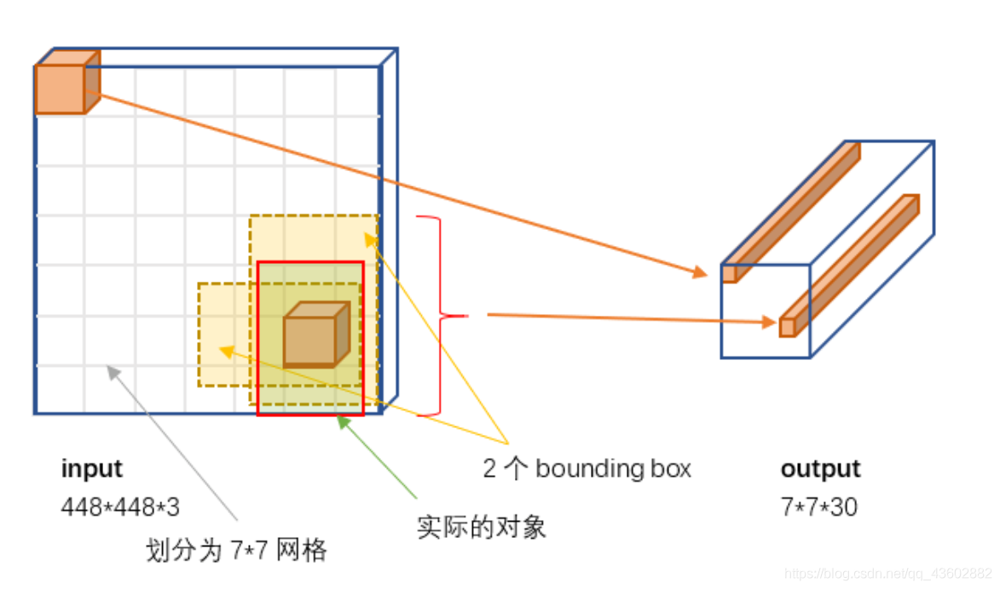
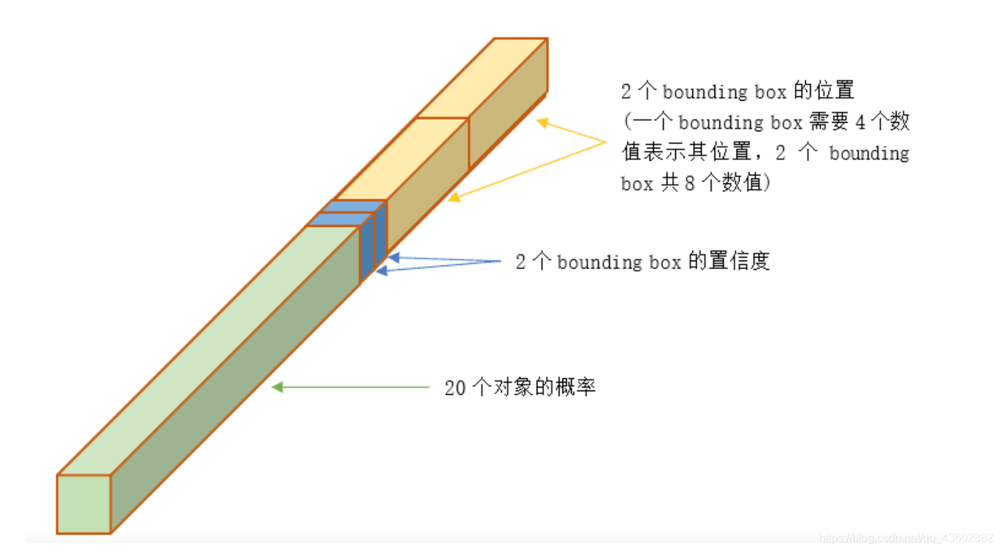
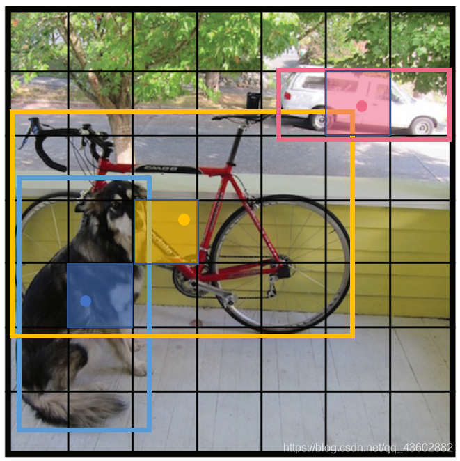
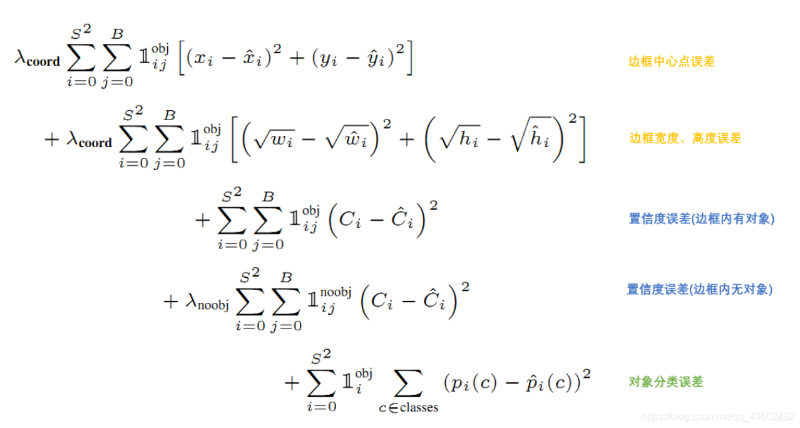
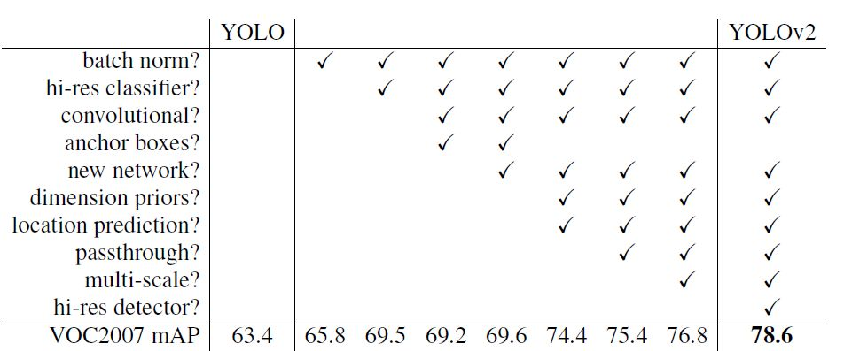

# You Only Look  Once

## Yolov1

### 1、网络结构

​	网络结构和普通的CNN对象分类网络没有本质区别。最大差异是最后输出层用线性函数作为激活函数。原因：**预测的bounding box的位置是数值型，而非对象的概率**

​	其他层使用的激活函数是leaky rectified activation:
$$
\phi(x)=\begin{cases}
x,   \quad \ \ if   \ x>0 \\
0.1x,\ otherwise
\end{cases}
$$

### 2、输入输出结构映射关系

- 输入是原始图像，固定大小作为输入，YOLO设计尺寸448×448
- 输出是一个7x7x30的张量

​       **YOLO将图像分成S×S（S=7）的网格grid cell，并且每个网格单元负责预测B（B=2）个边界框box。加上每个边界框box的置信度confidence，每个网格的C个条件类别概率**

### 3、训练样本标签

图中蓝色，黄色，粉色的框框就是我们标注时候的框框，对应的类别分别为 dog，bicycle，car

- 20个对象分类概率

  ​	论文中有个关键词“responsible”，给出了**仅由中心点所在的网格对预测该对象负责**的这样一个规定

  ​	 意思是说，每个对象（Object）都有一个框框，计算框框的中心点，中心点所在的网格（grid cell）对这个对象负责。例如，狗被标注了一个蓝色的框框，蓝色的框框中心是那个蓝色的圆点，圆点所在的网格（图中蓝色阴影的grid cell）对狗这个Object负责。

   	每个Object找到负责的grid cell后 这个grid cell对应的30维张量中那20个对象分类概率中就把这个Object的类别设为1，其他类别为0。继续上面的例子：蓝色阴影的grid cell对应的30维张量中的20个分类概率中，dog设为1，其他19个类设为0。同样的黄色阴影grid cell类别概率中bicycle设为1，其余19个位0，粉色grid cell类别概率中car设为1，其余19个位0。

  ​	 这样49个30维张量中，3个30维张量的对象分类概率得到了确定，那剩下45个呢？注意"仅由中心点所在的网格对预测该对象负责"这句话中的仅由二字，也就是说及时一个对象横跨了众多grid cell，我们也只关系这个对象中心点所在的grid cell，仅由这个grid cell负责。那剩下的45个30维张量的20个对象分类概率都为0！！！
  ​

- bounding box 

  置信度计算公式
  $$
  Confidence = Pr(Object)*IOU_{pred}^{truth}
  $$
  ​	训练时通过网络的输出，每个grid cell都有2个预测的bounding box。对于对对象负责的grid cell而言，将这两个预测的bounding box分别与真实的bounding box计算IOU，然后最重要的一步！比较两个IOU哪个大，由大的IOU对应的bounding box 负责预测这个对象

  ​	这个负责的bounding box 的$Pr(Object) = 1$,对应的$Confidence = IOU_{pred}^{truth}$;不负责的bounding box 的$Pr(Object) = 0$,对应的$Confidence  = 0$.

  ​	7×7个grid cell，每个grid cell 有两个bounding box ，共计7×7×2=98个bounding box,每个bounding box 都有一个 置信度confidence信息，那么98个中只有3个是计算出的IOU值，其余95个都是0

### 4、损失函数

### 5、预测（inference)与NMS（非极大值抑制）

在inference时，引入一个score公式：score为
$$
Pr(Class|Object)*Pr(Object)*IOU_{pred}^{truth} = Pr(Class)*IOU_{pred}^{truth}
$$
反映了每个bounding box 特定类别的置信度分数。

可前面提到**在inference时候并没有IOU，公式只是为了反应其意义**，对应到inference时候，就是每个bounding box的20个类别概率去乘bounding box 的置信度。

**NMS**对于某一类而言：

1.将所有框的得分排序，选中最高分及其对应的框。
2.遍历其余的框，如果和当前最高分框的重叠面积(**IOU**)大于一定阈值，我们就将框删除。
3.从未处理的框中继续选一个得分最高的，重复上述过程。

## Yolov2

### 1、改进策略

- **Batch Normalization**

  提升收敛速度，起到一定正则化效果，降低模型的过拟合，每个卷积层后面都添加Batch Normalization 层，不再使用dropout。

- **High Resolution Classifier**

- ​

- **Convolutional With Anchor Boxes**

- **Convolutional With Anchor Boxes**

- **Convolutional With Anchor Boxes**